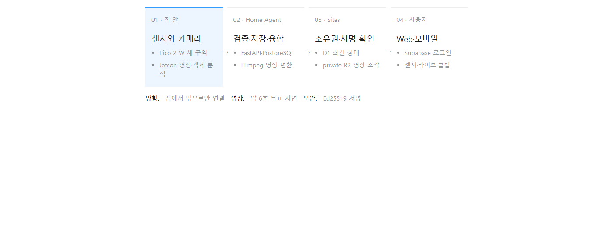
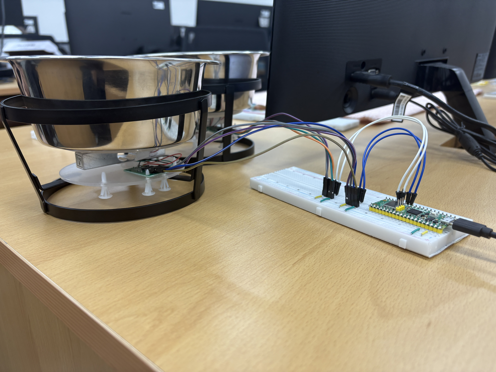
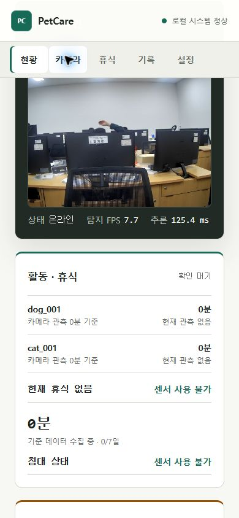
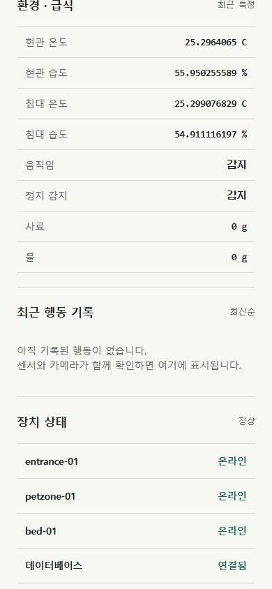

# PetCare Vision AIoT 발표 스크립트

발표자료: [PetCare-Vision-AIoT-Presentation.pdf](PetCare-Vision-AIoT-Presentation.pdf)  
웹 슬라이드: [output/presentation/petcare-aiot-presentation.html](output/presentation/petcare-aiot-presentation.html)  
권장 발표 시간: 15분에서 18분, 질의응답 5분

## 발표 전에 꼭 기억할 한 문장

> PetCare Vision AIoT는 침대, 급식·급수, 현관 센서와 카메라 영상을 집 안의 Home Agent에서 결합해 반려동물의 상태를 행동 정보로 바꾸고, 인증된 사용자에게 Web과 모바일로 보여주는 시스템입니다.

## 전체 구조 빠르게 이해하기

- Pico 2 W는 세 구역의 센서값을 MQTT로 보냅니다.
- Jetson은 640×480 영상을 30 FPS로 수집하고 객체 분석을 수행합니다.
- Home Agent는 센서와 영상을 검증·저장·융합하고, 영상은 H.264 fMP4로 변환합니다.
- Home Agent가 필요한 상태와 영상 조각을 서명해 밖으로 먼저 전송합니다.
- Sites는 D1에서 소유권과 최신 상태를 관리하고, private R2에서 영상 조각과 사건 클립을 보관합니다.
- 사용자는 Supabase 로그인 후 자기 가정의 데이터만 확인합니다.

## 발표 흐름 요약

1. 문제: 센서값 하나만으로는 행동을 설명하기 어렵다.
2. 해결: 센서와 카메라를 같은 시간축에서 결합한다.
3. 구현: Pico, Jetson, Home Agent, Sites의 역할을 분리했다.
4. 시연: 실제 계정으로 라이브 영상과 센서값을 확인한다.
5. 제품화: 고객 PC 설치형을 전용 PetCare Hub와 무설치 등록 방식으로 전환한다.

---

## 슬라이드별 발표 대본

### 1. 표지 | 20초

**핵심:** 무엇을 만든 프로젝트인지 한 번에 정의합니다.

**발표 문장**

“안녕하세요. 저희가 만든 PetCare Vision AIoT는 집 안의 센서와 카메라를 연결해 반려동물의 작은 신호를 하나의 상태로 읽어내는 시스템입니다. 단순히 숫자를 보여주는 것이 아니라, 지금 먹고 있는지, 쉬고 있는지, 이상 징후가 있는지를 설명하는 것이 목표입니다.”

**전환:** “먼저 왜 센서만으로는 부족한지 보겠습니다.”

### 2. 문제 정의 | 35초

**핵심:** 개별 센서는 사실을 일부만 보여줍니다.

**발표 문장**

“침대 압력이 올라갔다고 해서 반드시 반려동물이 누웠다고 단정할 수는 없습니다. 밥그릇 무게가 줄어도 실제로 먹은 것인지 사람이 건드린 것인지 알기 어렵습니다. 현관의 움직임도 반려동물과 사람을 구분해야 합니다. 그래서 한 종류의 센서값이 아니라 서로 다른 근거를 같은 시간에 확인해야 합니다.”

### 3. 해결 방법 | 35초

**핵심:** 센서, 영상, 판단, Web의 네 단계를 연결합니다.

**발표 문장**

“저희는 센서가 만든 수치와 카메라가 확인한 객체 위치를 Home Agent에서 결합합니다. 예를 들어 급식 구역에 반려동물이 30초 이상 머물고 사료 무게가 5g 이상 감소하면 식사 행동으로 기록합니다. 사용자는 그 결과와 근거를 Web에서 확인합니다.”

### 4. 침대 센서 | 40초

**발표 문장**

“침대에는 왼쪽, 가운데, 오른쪽의 세 채널 FSR을 배치했습니다. 압력 분포와 카메라의 침대 영역 점유를 함께 확인하며, 비어 있는 침대의 기준값은 60초 동안 보정합니다. 따라서 단순 접촉과 실제 휴식을 구분할 수 있습니다.”

### 5. 급식·급수 센서 | 40초

**발표 문장**

“밥그릇과 물그릇 아래에는 로드셀을 배치했습니다. 무게 변화만 보지 않고 카메라의 급식 영역 체류와 함께 봅니다. 현재 규칙은 급식 영역 30초 체류와 사료 5g 이상 감소를 식사의 핵심 근거로 사용합니다.”

### 6. 현관 센서 | 35초

**발표 문장**

“현관 노드는 온도, 습도, 움직임과 정적 존재를 감지합니다. Pico 2 W가 Wi-Fi와 MQTT QoS 1로 데이터를 보내므로 USB 연결 없이도 동작합니다. 현관 환경 변화와 출입 가능성을 가장 먼저 감지하는 구역입니다.”

### 7. 장치별 역할 | 45초

**발표 문장**

“Pico는 센서값을 안정적으로 수집하는 역할만 담당합니다. Jetson은 영상 수집과 객체 분석을 담당합니다. Home Agent는 로컬 판단과 저장, 영상 변환, 외부 전송을 담당합니다. Sites는 로그인, 소유권 확인, Web과 모바일 표시를 담당합니다. 역할을 나눈 이유는 한 장치가 멈춰도 전체 기능이 한꺼번에 무너지지 않게 하기 위해서입니다.”

### 8. 전체 시스템 구조 | 55초

**핵심:** 집 안으로 외부 연결을 열지 않습니다.

**발표 문장**

“최신 구조의 핵심은 외부에서 집 안으로 연결하지 않는 것입니다. Home Agent가 필요한 상태와 영상 조각을 HTTPS로 먼저 전송합니다. 공유기 포트를 열거나 Cloudflare Tunnel을 만들거나 고객에게 별도의 Cloudflare 계정을 요구하지 않습니다. D1은 소유권과 최신 상태를, private R2는 짧게 순환하는 라이브 영상 조각과 사건 클립을 담당합니다.”

**주의:** “Cloudflare를 전혀 사용하지 않는다”라고 말하면 안 됩니다. Tunnel은 사용하지 않지만 Sites의 D1과 R2는 사용합니다.

### 9. Home Agent 서버 구성 | 55초

**발표 문장**

“현재 Home Agent는 Windows 서비스 형태로 PostgreSQL, MQTT, FastAPI 작업자를 함께 시작합니다. FastAPI와 PostgreSQL은 loopback에 두고 MQTT는 사설 LAN에서만 접근하게 합니다. 센서 수집, 규칙 처리, 2초 상태 요약, 라이브 영상과 사건 클립 처리를 별도 작업자로 분리했습니다.”

**제품화 연결 문장:** “현재는 Windows 기반이지만 최종 제품은 고객 PC가 아니라 전용 PetCare Hub 안에서 이 기능이 동작하도록 바꿀 계획입니다.”

### 10. 센서 데이터 파이프라인 | 45초

**발표 문장**

“센서값은 측정, MQTT 발행, 형식 검증, PostgreSQL 저장, 영상 사건과의 융합 순서로 흐릅니다. Home Agent가 타입, 단위, 시각과 장치 프로필을 확인하므로 잘못된 장치값이 바로 행동 판단으로 들어가지 않습니다.”

### 11. 영상 파이프라인 | 55초

**발표 문장**

“Jetson은 고유 프레임을 640×480, 30 FPS로 수집합니다. 캡처와 TensorRT 추론 주기를 분리했기 때문에 영상 수집 속도와 객체 분석 FPS는 같은 숫자가 아닙니다. Home Agent는 사설 TLS/HMAC MJPEG를 받아 FFmpeg로 3초 H.264 fMP4 조각을 만들고, 브라우저는 MSE 또는 iPhone의 HLS로 재생합니다. 현재 목표 지연은 약 6초입니다.”

**중요:** 모바일 화면의 검출 FPS가 약 7.7로 보여도 오류가 아닙니다. 30 FPS는 영상 수집 기준이고, 검출 FPS는 모델 추론 속도입니다.

### 12. 외부 전송 계약 | 50초

**발표 문장**

“로그인 사용자가 만든 10분 등록 코드로 Home Agent의 Ed25519 공개키를 연결합니다. 이후 상태 요약은 2초마다, 라이브는 3초 영상 조각 단위로 전송합니다. BFF는 사용자, 가정, 카메라 소유권을 확인한 뒤에만 manifest와 비공개 영상 조각을 반환합니다. 사건 클립은 행동 전후 장면만 저장하고 7일 보존 정책을 적용합니다.”

### 13. 행동 융합 규칙 | 40초

**발표 문장**

“행동 이벤트는 서로 다른 두 근거가 같은 상황을 설명할 때 만듭니다. 식사는 카메라의 급식 영역 체류와 사료 무게 감소를 함께 봅니다. 휴식은 침대 영역과 FSR 점유를 함께 봅니다. 근거가 맞지 않을 때는 확정 행동 대신 경고로 표시합니다.”

### 14. 로컬 PostgreSQL 구조 | 55초

**발표 문장**

“로컬 DB는 센서, 영상, 판단의 세 영역으로 나뉩니다. devices와 sensor_readings가 장치와 측정값을 연결하고, cameras와 camera_events가 영상 관측을 기록합니다. 최종 behavior_events는 camera_event와 sensor_reading을 함께 참조해 어떤 근거로 행동을 판단했는지 추적할 수 있습니다. source_key는 같은 사건의 중복 생성을 막습니다.”

### 15. D1과 private R2 | 50초

**발표 문장**

“D1은 owner_sub, homes, agents, cameras를 중심으로 계정과 가정의 소유권을 관리합니다. 최신 snapshot과 live manifest도 D1에서 찾습니다. 실제 영상 바이트는 private R2에 저장하며 서버가 object key를 결정합니다. 브라우저에는 내부 장치 키나 R2 object key를 직접 노출하지 않습니다.”

### 16. 서버·보안 | 45초

**발표 문장**

“보안 흐름은 간단합니다. 집 안에서 먼저 처리하고 필요한 정보만 밖으로 보냅니다. 서버는 Ed25519 서명, 전송 시각, 일회용 값, SHA-256 digest와 계정 소유권을 확인합니다. 따라서 포트 개방 없이도 위변조와 재전송을 막고, 사용자는 자기 가정의 데이터만 볼 수 있습니다.”

### 17. Web 서비스 구성 | 35초

**발표 문장**

“공개 랜딩은 프로젝트 설명, `/demo`는 로그인 없이 볼 수 있는 체험 화면입니다. 실제 운영 데이터는 `/dashboard`에서 인증 후 확인합니다. 회원가입도 관리자 전용이 아니라 일반 사용자가 계정을 만들고 자기 가정을 등록할 수 있도록 구성되어 있습니다.”

### 18. 실제 시연 전환 | 2분에서 3분

**시연 주소:** <https://kr-hrd-petcare-aiot-team.cpark333333.chatgpt.site/dashboard>

**진행 순서**

1. 슬라이드의 “실제 관리자 화면 열기”를 누릅니다.
2. 준비한 실제 운영 계정으로 로그인합니다.
3. Home Agent가 온라인인지 먼저 확인합니다.
4. 라이브 영상에서 사무실 장면이 움직이는지 확인합니다.
5. 검출 FPS와 추론 시간을 짧게 보여줍니다.
6. 침대, 현관, 급식·급수 센서값과 각 장치의 온라인 상태를 보여줍니다.
7. “이 화면은 공개 demo가 아니라 로그인된 운영 데이터입니다”라고 강조합니다.
8. 브라우저를 닫거나 발표자료 탭으로 돌아와 다음 슬라이드로 이동합니다.

**시연 멘트**

“지금부터 공개 demo가 아니라 실제 운영 계정으로 접속하겠습니다. Home Agent가 온라인이고, Jetson 영상과 센서값이 같은 대시보드로 들어오는 것을 확인할 수 있습니다. 화면의 검출 FPS는 모델 추론 속도이며, 영상 캡처 기준 30 FPS와는 서로 다른 지표입니다.”

**시연 장애 시 대체 문장**

“현장 네트워크 상태 때문에 라이브 연결이 늦어질 수 있어, 바로 다음 장에 같은 운영 계정에서 확인한 모바일 캡처를 준비했습니다. 데이터 구성과 권한 흐름은 동일합니다.”

### 19. 실제 모바일 관리자 화면 | 45초

**발표 문장**

“이 화면은 demo UI가 아니라 실제 관리자 계정으로 로그인해 촬영한 모바일 화면입니다. 첫 화면에서는 라이브 영상, 장치 온라인 상태, 검출 FPS와 추론 시간을 확인할 수 있습니다. 두 번째 화면에서는 현관과 침대 환경값, 움직임, 데이터베이스와 MQTT 상태를 확인할 수 있습니다.”

### 20. 남은 개발 범위와 제품화 | 1분 10초

**발표 문장**

“현재 기능 시연은 가능하지만 제품화를 위해 남은 범위가 있습니다. 첫째, 브레드보드와 고객 Windows PC 의존을 없애고 Jetson과 Home Agent를 하나의 전용 PetCare Hub로 묶어야 합니다. QR 또는 SoftAP 방식으로 고객이 앱 설치 없이 Wi-Fi와 가정을 등록하도록 만들겠습니다. 둘째, 물 마시기, 배변, 놀이, 긁기와 다중 반려동물 식별까지 AI 행동 분석을 확장해야 합니다. 셋째, 공장 초기 등록, 서명 OTA, A/B rollback, 장시간 안정성 시험과 원격 상태 진단을 갖춰 설치가 아니라 장치군 운영이 가능하게 해야 합니다.”

**제품화 답변 한 줄:** “고객 PC마다 프로그램을 설치하는 구조가 아니라, 소프트웨어가 내장된 전용 Hub를 전원과 네트워크에 연결하고 Web에서 등록하는 구조로 전환합니다.”

### 21. 마무리 | 30초

**발표 문장**

“PetCare Vision AIoT는 센서가 신호를 만들고, AI가 그 신호의 맥락을 더하고, Web과 모바일이 사람이 이해할 수 있는 상태로 보여주는 프로젝트입니다. 현재는 실제 장치, Home Agent, 인증 대시보드와 라이브 영상까지 연결했습니다. 다음 단계는 이 기술을 누구나 설치할 수 있는 하나의 제품으로 완성하는 것입니다. 감사합니다.”

---

## 시연 당일 점검표

- [ ] 발표 노트북이 전원과 안정적인 네트워크에 연결되어 있다.
- [ ] 실제 운영 계정으로 로그인할 수 있다.
- [ ] Home Agent가 온라인으로 표시된다.
- [ ] Jetson 카메라 영상이 정상 재생된다.
- [ ] 화면에 “라이브 영상 연결이 지연되고 있습니다” 안내가 남아 있지 않다.
- [ ] 침대, 급식·급수, 현관 센서가 온라인이다.
- [ ] 브라우저 확대는 100%이고 모바일 확인 시 반응형 폭이 정상이다.
- [ ] 시연 후 발표자료 19번 슬라이드로 즉시 돌아올 수 있다.
- [ ] 네트워크 장애에 대비해 PDF와 모바일 캡처를 로컬에서 열어 두었다.

## 예상 질문과 답변

### Q1. 왜 센서와 카메라를 둘 다 사용합니까?

센서는 무게와 압력처럼 정량적인 변화를 잘 측정하지만 대상과 원인을 설명하기 어렵습니다. 카메라는 대상을 구분하지만 가려짐과 조명 영향을 받습니다. 두 근거를 결합하면 오탐을 줄이고 행동 판단의 근거도 남길 수 있습니다.

### Q2. 영상이 외부에 계속 저장됩니까?

라이브는 짧은 조각을 순환 보관하고, 사건 클립만 행동 전후 장면을 7일 정책으로 저장합니다. 장기 연속 녹화가 목적이 아니며 private R2와 인증된 BFF를 통해서만 접근합니다.

### Q3. Cloudflare Tunnel을 사용합니까?

사용하지 않습니다. 공유기 포트를 열거나 외부에서 Home Agent로 들어오는 연결도 없습니다. Home Agent가 서명한 상태와 영상 조각을 HTTPS로 먼저 보냅니다. 다만 Web 서비스 저장소로 D1과 private R2는 사용합니다.

### Q4. 30 FPS인데 화면에는 검출 FPS가 더 낮게 보이는 이유는 무엇입니까?

30 FPS는 카메라 영상 수집 속도입니다. 객체 검출 FPS는 TensorRT 모델이 분석을 수행하는 속도이므로 서로 다른 지표입니다. 캡처와 추론을 분리해 영상 재생이 추론 속도에 묶이지 않게 했습니다.

### Q5. 일반 사용자도 가입할 수 있습니까?

가능합니다. Supabase 인증으로 계정을 만들고, 10분 동안 유효한 등록 코드를 이용해 자기 Home Agent와 가정을 연결하는 구조입니다. 관리자 계정만 가능한 시스템이 아닙니다.

### Q6. 고객마다 Windows 프로그램을 설치해야 합니까?

현재 시제품은 Windows Home Agent를 사용하지만 제품 단계에서는 소프트웨어를 전용 PetCare Hub에 내장합니다. 고객은 전원과 네트워크를 연결하고 QR 또는 SoftAP로 등록하면 됩니다.

### Q7. 데이터베이스를 로컬과 클라우드로 나눈 이유는 무엇입니까?

로컬 PostgreSQL은 원시 센서값, 영상 관측, 행동 근거를 빠르고 상세하게 기록합니다. D1과 private R2는 인증된 사용자에게 필요한 최신 상태와 미디어만 전달합니다. 이 분리는 집 안 기능을 유지하면서 외부 노출과 전송량을 줄입니다.

### Q8. 가장 중요한 남은 개발은 무엇입니까?

하드웨어 패키징과 전용 Hub, 설치 없는 등록 과정, 장시간 안정성 시험, 서명 OTA와 rollback, 행동 분석 종류와 다중 반려동물 식별 확대입니다.

## 발표자가 피해야 할 표현

- “완전한 상용 제품입니다” 대신 “실제 장치와 운영 계정까지 연결된 시제품이며 제품화 로드맵이 남아 있습니다.”
- “영상 분석이 30 FPS입니다” 대신 “영상 수집은 30 FPS이고 검출 속도는 모델과 장치 부하에 따라 달라집니다.”
- “Cloudflare를 사용하지 않습니다” 대신 “Cloudflare Tunnel은 사용하지 않으며 D1과 private R2는 사용합니다.”
- “관리자만 가입할 수 있습니다” 대신 “일반 사용자가 가입하고 자기 가정을 등록할 수 있습니다.”
- “영상이 항상 실시간입니다” 대신 “현재 목표 재생 지연은 약 6초이며 네트워크 상태에 따라 달라질 수 있습니다.”
