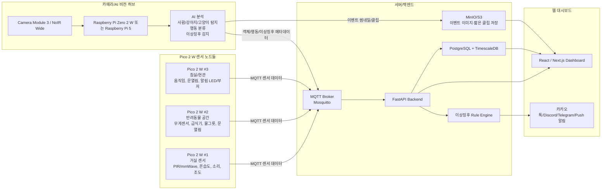
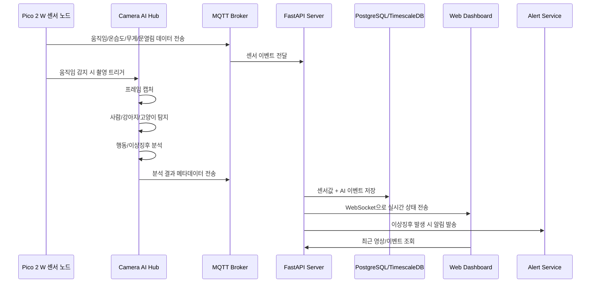

# 카메라 포함 AIoT 스마트 홈 프로젝트 기획안

**프로젝트 주제:** Pico 2 W와 카메라 기반 반려동물·사람 상태 분석 웹 대시보드  
**작성일:** 2026-07-09  

---

## 1. 핵심 방향

카메라를 넣는 것은 이 프로젝트의 핵심 경쟁력이 될 수 있다. 다만 중요한 점은 **Pico 2 W에 Raspberry Pi Camera Module 3 같은 공식 카메라를 직접 꽂는 구조는 비추천**이라는 것이다.

Pico 2 W는 마이크로컨트롤러라서 센서 수집, 제어, MQTT 전송에는 적합하지만, 공식 Raspberry Pi 카메라는 CSI 커넥터가 있는 Raspberry Pi 컴퓨터 계열을 대상으로 한다. Pico 2 W 사양에는 CSI 카메라 인터페이스가 아니라 SPI, I2C, UART, ADC, PIO, USB 등이 중심으로 제공된다.  
참고: [Raspberry Pi Pico 2](https://www.raspberrypi.com/products/raspberry-pi-pico-2/)

따라서 설계는 다음처럼 구성하는 것이 가장 현실적이다.

> **Pico 2 W는 센서 노드**, **Raspberry Pi Zero 2 W 또는 Raspberry Pi 5는 카메라/AI 비전 허브**로 역할을 나눈다.

Camera Module 3는 12MP IMX708 센서, autofocus, HDR, 1080p50 영상, 일반/Wide/NoIR 버전을 지원하므로 반려동물과 사람 상태 모니터링에 적합하다. 특히 야간 감시까지 고려하면 **Camera Module 3 NoIR Wide + IR LED** 조합이 좋다. NoIR는 적외선 필터가 없어 IR 조명과 함께 어두운 환경을 볼 수 있고, Wide 모델은 더 넓은 화각을 제공한다.  
참고: [Raspberry Pi Camera Module 3](https://www.raspberrypi.com/products/camera-module-3/)

---

## 2. 카메라 포함 최종 아키텍처



---

## 3. 권장 하드웨어 구성

| 구분 | 권장 부품 | 역할 |
|---|---|---|
| 센서 노드 | Raspberry Pi Pico 2 W | 온습도, 조도, 움직임, 문열림, 급식/물그릇, 침대 무게, 알림 제어 |
| 카메라 허브 저가형 | Raspberry Pi Zero 2 W + Camera Module 3 NoIR Wide | 1대 카메라 기반 실시간 모니터링 |
| 카메라 허브 고성능형 | Raspberry Pi 5 + Camera Module 3 / AI Camera | 다중 카메라, 더 빠른 AI 분석, 장기 확장 |
| 야간 감시 | Camera Module 3 NoIR + IR LED | 어두운 곳에서 반려동물/사람 움직임 감지 |
| 움직임 감지 | PIR 또는 mmWave 센서 | 카메라를 계속 켜지 않고 이벤트 발생 시 촬영 |
| 반려동물 상태 | 로드셀 + HX711 | 밥그릇/물그릇/침대 무게 변화 감지 |
| 환경 상태 | SHT31/BME280, 조도센서 | 온도, 습도, 조도, 생활 환경 분석 |

Zero 2 W는 1GHz quad-core CPU, 512MB RAM, Wi-Fi, CSI-2 카메라 커넥터, 1080p30 H.264 encode를 제공하므로 저가형 카메라 허브로 적합하다. Raspberry Pi 5는 더 강한 CPU, 최대 16GB RAM, USB 3.0, 2개의 4-lane MIPI camera/display transceiver를 제공하므로 다중 카메라나 고성능 AI 추론까지 고려하면 더 좋다.  
참고: [Raspberry Pi Zero 2 W](https://www.raspberrypi.com/products/raspberry-pi-zero-2-w/), [Raspberry Pi 5](https://www.raspberrypi.com/products/raspberry-pi-5/)

---

## 4. Pico 2 W에 카메라를 직접 붙이는 방식

가능은 하지만 **메인 설계로는 비추천**이다.

Pico 2 W는 150MHz급 dual-core RP2350, 520KB SRAM, 2.4GHz Wi-Fi/Bluetooth 5.2를 가진 마이크로컨트롤러라 센서 처리에는 좋지만, 영상 프레임을 안정적으로 다루고 AI 모델을 돌리기에는 메모리와 입출력 구조가 제한적이다. 공식 Raspberry Pi 카메라들은 CSI 기반이고, Raspberry Pi 문서도 카메라 모듈은 CSI 커넥터가 있는 Raspberry Pi 컴퓨터와 호환된다고 설명한다.  
참고: [Raspberry Pi Pico 2](https://www.raspberrypi.com/products/raspberry-pi-pico-2/)

그래도 “Pico 2 W만으로 카메라 데모”를 하고 싶다면 다음 정도는 가능하다.

| 방식 | 가능 기능 | 한계 |
|---|---|---|
| Pico 2 W + 저해상도 SPI 카메라 | 저해상도 스냅샷, 움직임 이벤트 캡처 | FPS 낮음, AI 분석 어려움 |
| Pico 2 W + 외부 카메라 모듈 + 서버 전송 | 이벤트 발생 시 사진 전송 | 구현 난이도 높음, 안정성 낮음 |
| Pico 2 W + PIR/mmWave + 카메라 허브 트리거 | 움직임 감지 후 Pi 카메라 촬영 | 가장 현실적이고 안정적 |

즉, **Pico는 카메라를 깨우는 트리거 역할**, **Pi는 카메라 영상 처리 역할**로 나누는 것이 적합하다.

---

## 5. 카메라 기반 기능 설계

### 5.1 사람/반려동물 감지

카메라 허브에서 프레임을 가져와 다음 객체를 탐지한다.

| 탐지 대상 | 활용 |
|---|---|
| 사람 | 재실 여부, 낙상 의심, 장시간 움직임 없음 |
| 강아지 | 위치, 활동량, 밥/물/화장실 접근 |
| 고양이 | 위치, 활동량, 캣타워/화장실/급식기 접근 |
| 밥그릇/물그릇 영역 | 식사/음수 행동 추정 |
| 침대/방석 영역 | 수면 시간, 장시간 누워 있음 |
| 현관/문 영역 | 외출/귀가, 반려동물 접근 위험 |

### 5.2 행동 분석

처음부터 “건강 진단”을 목표로 잡기보다는, **행동 패턴 기반 이상징후 감지**로 가는 것이 좋다.

| 행동 | 분석 방법 | 대시보드 표시 |
|---|---|---|
| 걷기/뛰기 | 객체 추적 + 이동량 계산 | 활동량 그래프 |
| 누워있기 | 특정 영역 체류 시간 | 수면/휴식 시간 |
| 밥 먹기 | 급식기 ROI 체류 + 무게센서 변화 | 식사 횟수/시간 |
| 물 마시기 | 물그릇 ROI 체류 + 수위/무게 변화 | 음수 패턴 |
| 화장실 사용 | 화장실 ROI 진입/체류 | 배변 추정 로그 |
| 사람 낙상 의심 | 사람 자세 변화 + 장시간 미움직임 | 긴급 알림 |
| 반려동물 이상징후 | 평소보다 활동량 급감/급증 | 주의 알림 |

여기서 “건강 상태”는 의료·수의학적 진단이 아니라, **평소 패턴 대비 이상 여부**로 표현하는 것이 안전하고 현실적이다. 예를 들어 “고양이가 아프다”가 아니라 “최근 24시간 활동량이 평소 대비 60% 감소했습니다”처럼 보여주는 방식이다.

---

## 6. 카메라 데이터 흐름



---

## 7. AI 분석 구조

### 7.1 1단계: 객체 탐지

카메라 프레임에서 `person`, `dog`, `cat`을 탐지한다.

저가형 MVP에서는 다음 정도로 시작하면 충분하다.

```text
입력: 카메라 프레임
출력:
- object_type: person / dog / cat
- confidence: 0.0 ~ 1.0
- bounding_box: x, y, width, height
- location_zone: 거실 / 현관 / 급식기 / 침대 / 화장실
```

### 7.2 2단계: 추적

탐지된 객체를 프레임마다 연결해서 “같은 강아지가 어디로 이동했는지” 추적한다.

```text
track_id: pet_001
object_type: dog
current_zone: living_room
movement_distance_5min: 12.4m
inactive_duration: 18min
```

### 7.3 3단계: 행동 분류

처음에는 딥러닝 행동 모델보다 **ROI + 시간 + 센서 융합**으로 구현하는 것이 좋다.

예시 1:

```text
고양이가 화장실 영역에 45초 이상 머무름
+ 화장실 무게센서 변화 발생
= 화장실 사용 이벤트
```

예시 2:

```text
강아지가 밥그릇 영역에 30초 이상 머무름
+ 밥그릇 무게 감소
= 식사 이벤트
```

예시 3:

```text
사람이 바닥 근처 위치로 급격히 이동
+ 2분 이상 움직임 없음
= 낙상 의심 이벤트
```

### 7.4 4단계: 이상징후 판단

```text
이상징후 예시:
- 평소보다 활동량 급감
- 물 마시는 횟수 급증
- 밥을 먹지 않음
- 화장실 사용 횟수 급증/급감
- 특정 구역에 비정상적으로 오래 머무름
- 사람 낙상 의심
- 야간에 현관/위험구역 접근
```

---

## 8. 카메라 선택안

### A안: MVP 추천

**Raspberry Pi Zero 2 W + Camera Module 3 NoIR Wide + Pico 2 W 센서 노드**

장점은 저렴하고 구조가 단순하다는 것이다. 방 하나 또는 거실 하나를 모니터링하는 MVP에 적합하다. Zero 2 W는 CSI-2 카메라 커넥터와 Wi-Fi를 제공하고, Camera Module 3는 NoIR/Wide 옵션이 있어 반려동물 야간 모니터링에 유리하다.  
참고: [Raspberry Pi Zero 2 W](https://www.raspberrypi.com/products/raspberry-pi-zero-2-w/)

추천 구성:

```text
Pico 2 W 2~3대
Raspberry Pi Zero 2 W 1대
Camera Module 3 NoIR Wide 1대
IR LED 조명
PIR 또는 mmWave 센서
온습도 센서
로드셀 + HX711
FastAPI 서버
React 대시보드
MQTT Broker
```

### B안: 성능형 추천

**Raspberry Pi 5 + Camera Module 3 2대 + Pico 2 W 센서 노드**

다중 카메라, 더 빠른 추론, 여러 방 분석까지 확장하려면 Pi 5가 좋다. Pi 5는 2개의 MIPI camera/display transceiver를 제공해서 카메라 2대 구성이 가능하고, CPU/RAM 여유도 훨씬 크다.  
참고: [Raspberry Pi 5](https://www.raspberrypi.com/products/raspberry-pi-5/)

추천 구성:

```text
Pico 2 W 3~5대
Raspberry Pi 5 1대
Camera Module 3 Wide 1대
Camera Module 3 NoIR 1대
IR LED
PostgreSQL + TimescaleDB
MinIO
FastAPI
React/Next.js
```

### C안: AI 카메라형

**Raspberry Pi + Raspberry Pi AI Camera + Pico 2 W 센서 노드**

Raspberry Pi AI Camera는 Sony IMX500 Intelligent Vision Sensor를 사용하고, 카메라 모듈 자체의 AI processor에서 신경망 모델을 실행할 수 있도록 설계된 제품이다. 공식 설명 기준으로 Raspberry Pi 컴퓨터와 호환되며, 비전 AI 애플리케이션을 단순화하는 방향이라 프로젝트 완성도를 높이기에 좋다.  
참고: [Raspberry Pi AI Camera](https://www.raspberrypi.com/products/ai-camera/)

다만 가격이 더 높고, 처음 개발 난이도는 Camera Module 3 + 일반 모델보다 높을 수 있다. 졸업작품, 공모전, 포트폴리오라면 “고급 확장안”으로 넣기 좋다.

---

## 9. 수정된 프로젝트 기획안 요약

### 프로젝트명

**PetCare Vision AIoT Smart Home Dashboard**

### 목표

Pico 2 W 기반 센서 노드와 Raspberry Pi 카메라 허브를 연동하여, 집 안의 사람·강아지·고양이의 위치, 활동량, 생활 패턴, 환경 상태, 이상징후를 실시간으로 분석하고 웹 대시보드에 시각화한다.

### 핵심 기능

| 기능 | 설명 |
|---|---|
| 실시간 객체 감지 | 사람/강아지/고양이 탐지 |
| 위치 추적 | 거실, 현관, 침대, 밥그릇, 화장실 등 구역별 체류 |
| 활동량 분석 | 이동 거리, 움직임 빈도, 휴식 시간 |
| 식사/음수 추정 | 카메라 ROI + 무게센서 융합 |
| 화장실 사용 추정 | 카메라 ROI + 무게센서/문열림 센서 융합 |
| 사람 이상징후 | 낙상 의심, 장시간 미움직임 |
| 반려동물 이상징후 | 활동량 급감, 식사 없음, 물 섭취 급증 등 |
| 실시간 대시보드 | 현재 상태, 이벤트 타임라인, 그래프, 카메라 썸네일 |
| 알림 | 이상징후 발생 시 푸시/카카오톡/디스코드/텔레그램 알림 |
| 프라이버시 보호 | 이벤트 중심 저장, 얼굴 블러, 영상 보관 기간 제한 |

---

## 10. 대시보드 화면 구성

```text
[홈 화면]
- 현재 집 상태: 정상 / 주의 / 위험
- 현재 감지 대상: 사람 1명, 강아지 1마리, 고양이 1마리
- 현재 위치: 강아지=거실, 고양이=방석, 사람=침실
- 온도/습도/조도
- 최근 이상징후

[카메라 화면]
- 실시간 저해상도 스트림
- 객체 박스 표시
- 사람/강아지/고양이 confidence
- 구역별 ROI 표시

[반려동물 건강/행동 화면]
- 오늘 활동량
- 식사 횟수
- 물 마신 횟수
- 화장실 사용 추정 횟수
- 수면/휴식 시간
- 평소 대비 변화율

[이벤트 타임라인]
- 09:12 강아지 밥그릇 접근
- 09:13 사료 무게 18g 감소
- 10:25 고양이 화장실 사용 추정
- 14:02 사람 낙상 의심 없음
- 21:40 야간 현관 접근 감지

[알림 설정]
- 밥을 12시간 이상 안 먹으면 알림
- 물 섭취량 급증 시 알림
- 사람이 5분 이상 바닥에서 움직이지 않으면 긴급 알림
- 반려동물이 현관 근처에 오래 있으면 알림
```

---

## 11. 데이터베이스 설계 추가

### 11.1 camera_events

```sql
CREATE TABLE camera_events (
    id BIGSERIAL PRIMARY KEY,
    camera_id VARCHAR(50) NOT NULL,
    detected_type VARCHAR(30) NOT NULL, -- person, dog, cat
    track_id VARCHAR(50),
    confidence FLOAT NOT NULL,
    zone VARCHAR(50),
    bbox_x INT,
    bbox_y INT,
    bbox_w INT,
    bbox_h INT,
    image_url TEXT,
    created_at TIMESTAMPTZ DEFAULT NOW()
);
```

### 11.2 behavior_events

```sql
CREATE TABLE behavior_events (
    id BIGSERIAL PRIMARY KEY,
    subject_type VARCHAR(30) NOT NULL, -- person, dog, cat
    subject_id VARCHAR(50),
    behavior_type VARCHAR(50) NOT NULL,
    -- eating, drinking, sleeping, walking, toilet, fall_suspected, inactive
    zone VARCHAR(50),
    severity VARCHAR(20), -- normal, warning, danger
    confidence FLOAT,
    description TEXT,
    created_at TIMESTAMPTZ DEFAULT NOW()
);
```

### 11.3 sensor_readings

```sql
CREATE TABLE sensor_readings (
    id BIGSERIAL PRIMARY KEY,
    device_id VARCHAR(50) NOT NULL,
    sensor_type VARCHAR(50) NOT NULL,
    value FLOAT NOT NULL,
    unit VARCHAR(20),
    created_at TIMESTAMPTZ DEFAULT NOW()
);
```

---

## 12. MQTT 토픽 설계

```text
home/pico/livingroom/temperature
home/pico/livingroom/humidity
home/pico/livingroom/motion
home/pico/petzone/food_weight
home/pico/petzone/water_weight
home/pico/petzone/bed_weight

home/camera/livingroom/detection
home/camera/livingroom/behavior
home/camera/livingroom/anomaly

home/alert/warning
home/alert/danger
```

예시 메시지:

```json
{
  "camera_id": "livingroom_cam_01",
  "detected_type": "cat",
  "track_id": "cat_001",
  "zone": "pet_bed",
  "behavior": "resting",
  "confidence": 0.91,
  "timestamp": "2026-07-09T15:20:00+09:00"
}
```

---

## 13. 개발 순서 추천

### 13.1 1단계: 센서 + 대시보드 MVP

```text
Pico 2 W → MQTT → FastAPI → DB → React Dashboard
```

구현 기능:

```text
온습도
움직임 감지
밥그릇/물그릇 무게
문열림
실시간 그래프
```

### 13.2 2단계: 카메라 허브 추가

```text
Raspberry Pi Zero 2 W 또는 Pi 5
+ Camera Module 3 NoIR Wide
+ 객체 감지
+ 이벤트 썸네일 저장
```

구현 기능:

```text
사람/강아지/고양이 감지
카메라 이벤트 타임라인
실시간 썸네일
구역별 체류 시간
```

### 13.3 3단계: 행동 분석

```text
객체 탐지 + ROI + 센서 데이터 융합
```

구현 기능:

```text
식사 추정
물 마심 추정
화장실 사용 추정
수면/휴식 시간
활동량 변화
```

### 13.4 4단계: 이상징후 알림

```text
Rule Engine + 사용자별 기준값
```

구현 기능:

```text
12시간 식사 없음
활동량 급감
물 섭취량 급증
낙상 의심
야간 위험구역 접근
```

---

## 14. 최종 추천 구성

가장 추천하는 구성은 다음과 같다.

```text
[센서]
Pico 2 W 2~3대

[카메라]
Raspberry Pi Zero 2 W 1대
Camera Module 3 NoIR Wide 1대
IR LED 1개

[서버]
FastAPI
Mosquitto MQTT
PostgreSQL + TimescaleDB
MinIO
React 또는 Next.js

[AI]
1차: 사람/강아지/고양이 탐지
2차: ROI 기반 행동 분석
3차: 평소 패턴 대비 이상징후 감지
```

한 줄로 정리하면:

> **Pico 2 W는 집 안 곳곳의 센서를 담당하고, Raspberry Pi 카메라 허브가 사람/강아지/고양이 영상을 분석해서, 모든 결과를 웹 대시보드에 실시간으로 보여주는 AIoT 스마트 홈 시스템**으로 설계하면 된다.
