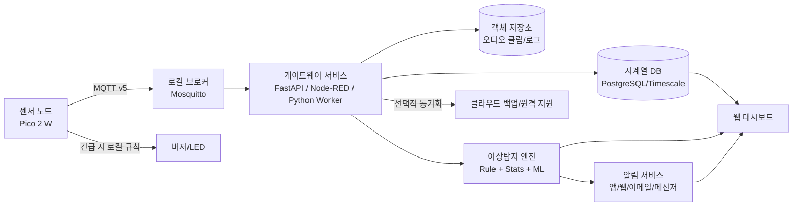
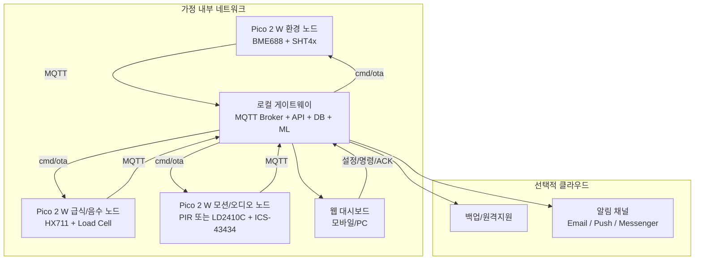
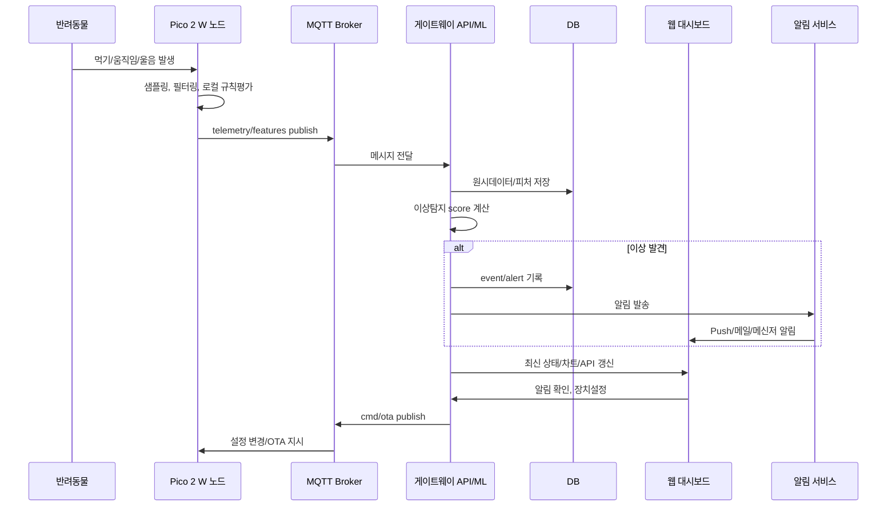
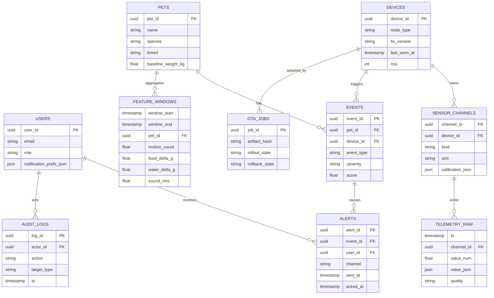

# Raspberry Pi Pico 2 W 기반 AIoT 스마트홈 프로젝트 기획안 및 아키텍처 설계

## 요약

본 기획안은 **개·고양이 가정**을 대상으로, Raspberry Pi Pico 2 W를 센서 노드의 기본 MCU로 사용하는 **반려동물 중심 AIoT 스마트홈 시스템**을 제안한다. 권장 아키텍처는 `Pico 2 W 센서 노드 → 로컬 게이트웨이 → 로컬/클라우드 저장소 → 웹 대시보드/알림`의 하이브리드 구조다. Pico 2 W는 RP2350 기반으로 최대 150MHz, 520kB SRAM, 2.4GHz 802.11n Wi‑Fi와 Bluetooth 5.2를 제공하고, SDK 차원에서 lwIP·BTstack·HTTPS/MQTT 예제가 준비되어 있어 센서 수집·저지연 제어·보안 부팅·OTA의 실무 구현 기반이 충분하다. 다만 대시보드, 복합 이상징후 분석, 장기 이력 관리, 모델 재학습은 MCU보다 **게이트웨이/서버 계층**으로 분리하는 편이 현실적이다. citeturn22view0turn29view3turn29view4turn35view0turn30view0

실무적으로는 **MVP에서 “실시간 상태 + 규칙기반 이상탐지 + 알림 + 이력관리”를 먼저 구현**하고, 이후 데이터가 쌓이면 **통계 기반 이상치 탐지**, **게이트웨이 ML**, 마지막으로 **경량 딥러닝**을 도입하는 단계형 전략이 가장 성공 확률이 높다. IoT 이상탐지 연구 전반에서 다중 센서 통합, 라벨 부족, 개념 드리프트가 반복 과제로 지적되며, 반려동물 행동 인식도 충분한 실제 라벨 데이터가 있을 때 성능이 크게 오른다. 예컨대 개 행동 인식 연구에서는 먹기/마시기 행동에서 높은 민감도·특이도가 보고되었고, 고양이의 다중 센서 기반 1D‑CNN 연구에서는 98.9% 정확도가 보고되었다. 반대로 이런 수준의 정확도는 **실제 라벨과 센서 배치 최적화**가 전제될 때 가능하므로, 본 프로젝트의 초기 목표는 “질병 진단”보다 **생활패턴 이탈 탐지와 조기 이상징후 경보**로 정의하는 것이 타당하다. citeturn30view5turn39view0turn30view3turn36view0

가정은 다음과 같이 둔다. 대상 반려동물은 사용자의 요청에 따라 **개·고양이**로 한정한다. 사용자 수와 동시접속 수는 미지정이므로 보고서에서 별도 용량산정은 하지 않는다. 예산 또한 미지정이므로 부품비는 **범위형 추정치**로 제시하고, 인건비는 조직별 편차가 커서 **MM 기준 리소스 산정** 중심으로 제안한다.

## 프로젝트 범위와 기능 우선순위

이 프로젝트의 핵심 목적은 반려동물의 **실시간 상태 파악**, **건강 관련 행동 패턴의 기준선 형성**, **이상징후 조기 감지**, **다채널 알림**, **장기 히스토리 관리**를 한 시스템으로 묶는 것이다. Pico 2 W는 MCU 레벨에서 빠른 센서 폴링과 무선 연결에 적합하고, RP2350은 secure boot와 OTP 기반 키 저장, SHA‑256 가속기, TRNG, glitch detector 같은 보안 기능을 제공하므로 “가정용이지만 장기 운영되는 IoT 장치”라는 조건에 잘 맞는다. citeturn24view0turn35view0turn35view1turn34view2turn34view3turn35view3

프로젝트 범위를 실무적으로 정의하면 다음과 같다.

| 구분 | 목표 | 주 데이터 | 구현 우선순위 |
|---|---|---|---|
| 실시간 상태 | 방 환경, 먹이/물, 활동 여부, 소리 이벤트를 현재 상태로 노출 | 온습도, 공기질, 모션, 그릇 무게, 소리 레벨 | 필수 |
| 건강 패턴 | 식사/음수/배변·휴식 패턴의 기초선 생성 | 시간대별 섭취량, 체류시간, 활동량, 야간 소음 | 필수 |
| 이상징후 탐지 | 무기력, 과도한 음수/급식 변화, 활동 급감, 환경 악화, 과도한 울음/짖음 탐지 | 시계열 피처 + 규칙/통계/ML score | 필수 |
| 알림 | 앱/웹/메신저/이메일 알림, 중복억제, 확인 처리 | severity, ack, cooldown | 필수 |
| 이력관리 | 일·주·월 리포트, 이벤트 타임라인, 비교 분석 | 요약 피처, 이벤트 로그 | 필수 |
| 장치관리 | 원격 설정, OTA, 펌웨어 버전/헬스체크 | firmware, RSSI, battery/power | 상 |
| 사용자·권한 | 보호자/가족/관리자 구분 | user, role, pet assignment | 상 |
| 고급 AI | 먹기/마시기/휴식/배변 패턴 분류, 음성 이벤트 분류 | 라벨링된 멀티센서 데이터 | 중 |
| 웨어러블 확장 | BLE 목걸이 태그/IMU 연동 | accelerometer, gyro, beacon | 중 |

우선순위는 명확해야 한다. **초기 제품 가치**는 “지금 어떤 상태인가”와 “이상한 일이 생겼는가”에서 나온다. 따라서 MVP는 대시보드의 화려함보다도, **센서 신뢰도·알림 정확도·이력 보존·운영 안정성**에 투자해야 한다. 반려동물 헬스케어 영역에서 실제로 가치가 큰 것은 수의학적 확정 진단보다, **먹이/물/활동/휴식/환경의 평소와 다른 패턴을 보호자에게 빠르게 알려주는 것**이기 때문이다. 개 행동 인식 연구가 먹기·마시기·긁기·핥기 같은 건강 관련 행동을 높은 정확도로 다룰 수 있음을 보여주고, 고양이 연구도 다중 센서 융합이 강한 분류 성능을 낸다는 점에서, 본 시스템은 **행동 직접 분류 + 환경 간접 지표**를 함께 쓰는 방향이 적절하다. citeturn30view3turn36view0

## 하드웨어 구성과 예상 비용

Pico 2 W는 2.4GHz Wi‑Fi/Bluetooth 5.2, VSYS 1.8–5.5V, 26개 노출 GPIO, USB 드래그앤드롭 프로그래밍, SWD 디버깅을 제공한다. 또한 Raspberry Pi 공식 문서에는 Pico 2 W를 RP2350·520kB SRAM·4MB 스토리지로 소개하지만, 같은 Pico 2 W 데이터시트의 다른 위치에서는 “4MB flash memory”와 “on-board 2MB QSPI flash”가 **동시에 나타난다**. 따라서 OTA 파티션 설계와 파일시스템 크기 산정은 보수적으로 **2MB 기준으로 시작하고**, 실제 보드 리비전은 `picotool` 또는 BOM 확인으로 검증하는 것이 안전하다. 이 지점은 본 프로젝트에서 특히 중요하다. OTA·로그 캐시·모델 저장 공간에 직접 영향을 주기 때문이다. citeturn24view0turn24view1turn24view2turn22view0

### 하드웨어 비교 표

| 역할 | 권장 모델 | 핵심 사양 | 대체품 | 전원·소비전력 | 인터페이스 | 공개 가격 기준 | 설계 메모 |
|---|---|---|---|---|---|---|---|
| 메인 MCU/무선 노드 | **Raspberry Pi Pico 2 W** | RP2350, 최대 150MHz, 520kB SRAM, 2.4GHz 802.11n, Bluetooth 5.2, VSYS 1.8–5.5V citeturn24view0turn24view2turn20view0 | Pico 2, Pico W, RM2 기반 커스텀 보드 citeturn17search3turn22view0 | 5V USB 또는 1셀 배터리 + 레귤레이터 | GPIO, I2C, SPI, UART, I2S, PIO | **US$7** citeturn20view0 | 센서 노드 기본 보드. OTA·보안부팅에 적합 |
| 공기질·온습도 복합 | **BME688** | 온도·습도·압력·가스, VOC/VSC/CO/H₂ ppb 범위 반응, I2C 최대 3.4MHz/SPI 10MHz, 1.71–3.6V, sleep 0.15µA citeturn27view0turn27view1turn27view2turn27view3turn27view4 | BME680, SGP40+SHT4x 조합 | 3.3V 권장 | I2C 또는 SPI | **US$19.95**(Adafruit breakout) citeturn37search0 | 실내 공기질 이상과 환경 변화를 동시에 수집 |
| 정밀 온습도 | **SHT41** 또는 SHT40 모듈 | SHT41 온도 typ. ±0.2°C, SHT4x 1.08–3.6V, 평균 0.4µA, I2C FM+, 다중 주소 옵션 citeturn24view4turn27view5turn27view6 | SHT45, AHT20 | 3.3V | I2C | **US$5.95**(SHT40 breakout) citeturn25view5turn26view1 | 장기 안정성 높은 기준 온습도 채널로 적합 |
| 모션 감지 기본형 | **Panasonic EKMC1601111** | 디지털 출력, 대기전류 170µA, 감지 거리 5m, Vdd 3–6V 계열 사용 사례 citeturn25view1turn26view3turn24view11 | EKMB 저전력 PIR, HC‑SR501 모듈 | 3–6V | 디지털 GPIO | **S$13.49** 또는 유통가 대략 US$10–14 수준 citeturn26view3turn37search7 | 저전력·저복잡도. 작은 반려동물 감지는 설치 각도 튜닝 필요 |
| 존재 감지 고급형 | **HLK‑LD2410C** | 24GHz FMCW, 정지·움직임 상태 식별, UART/BLE 파라미터 조정, 소형 16×22mm급 citeturn27view10turn27view11turn38search12 | PIR와 병행 구성 | 모듈 버전에 따라 3.3V 또는 5V 확인 필요 | UART, GPIO, 일부 BLE 설정 | **US$4.98**(Hi‑Link test board kit) citeturn38search12 | 소형 동물은 반사 특성 편차가 있어 PIR와 병행 권장 |
| 급식/음수/체중 변화 | **HX711 + TAL220 10kg 로드셀** | HX711 24‑bit ADC, 2.6–5.5V, normal <1.5mA; TAL220 10kg, IP66 citeturn24view8turn24view9turn28view0turn28view1 | NAU7802 + 로드셀 | 3.3V 또는 5V | 2선식 clock/data + 브리지 센서 | **US$4.95 + US$12.95** citeturn25view4turn28view0 | 급식량·음수량·화장실 체류/체중 추정 핵심 센서 |
| 음성/소리 이상 | **ICS‑43434** | 디지털 I2S 출력, typ. 65dBA SNR, typ. 490µA, 60Hz low cutoff, 3.5×2.65×0.98mm citeturn27view7turn27view8turn27view9turn25view2 | INMP441, SPH0645 | 3.3V | I2S | **US$8.95** citeturn25view3 | 짖음·울음 빈도, 야간 소음, 기침 유사 이벤트 분석용 |
| 오픈소스 연동 게이트웨이 | **기존 Home Assistant 호스트 또는 라즈베리 파이/미니PC** | MQTT v5 브로커, 대시보드, 장치 상태 통합에 적합 citeturn29view1turn29view0 | NAS, Docker 호스트 | 상시 전원 | Ethernet/Wi‑Fi | 환경별 상이 | 가능하면 기존 홈서버 재사용으로 총비용 절감 |

### 예상 비용 표

아래 비용은 위 공개 소매가를 조합해 만든 **범위형 추정**이다. 해외 유통가·환율·케이스·배선·전원 어댑터 포함 여부에 따라 차이가 크므로, 실제 구매 단계에서는 국내 유통가로 다시 검산하는 것이 좋다. 기준이 된 공개가에는 Pico 2 W US$7, BME688 US$19.95, SHT40 US$5.95, ICS‑43434 US$8.95, HX711 US$4.95, TAL220 US$12.95, PIR US$10~14대, LD2410C 약 US$4.98가 포함된다. citeturn20view0turn37search0turn25view5turn25view3turn25view4turn28view0turn26view3turn38search12

| 구성안 | 포함 예시 | 부품비 추정 |
|---|---|---|
| 초소형 MVP | Pico 2 W 1개 + SHT40 1개 + PIR 1개 + 기본 전원/케이스 | **약 US$25–40** |
| 급식/음수 노드 | Pico 2 W 1개 + HX711 1개 + TAL220 1개 + 방수 하우징/받침 | **약 US$30–55** |
| 고급 환경 노드 | Pico 2 W 1개 + BME688 1개 + ICS‑43434 1개 + 기본 전원 | **약 US$35–50** |
| 표준 1가구 세트 | 환경 노드 1 + 급식 노드 1 + 거실 모션 노드 1 | **약 US$90–180** |
| 확장형 | 표준 세트 + mmWave + 추가 로드셀/오디오 + 예비 보드 | **약 US$150–280** |

실무 권고안은 다음과 같다.  
환경 기준선은 **BME688 1개 + SHT4x 1개**를 같이 두는 구성이 좋다. BME688은 매우 유용하지만 가스 계열 값은 환경에 민감하고 캘리브레이션 영향이 있으므로, SHT4x를 **“기준 온습도 채널”**로 두면 장기 해석이 안정적이다. 활동 감지는 PIR만으로도 MVP는 가능하지만, 개·고양이처럼 작은 몸집과 낮은 위치 움직임을 고려하면 **PIR + 로드셀 패턴 + 소리 이벤트**를 함께 써야 오탐이 줄어든다. mmWave는 고급형 옵션으로 좋지만, 소형 반려동물 반사 특성 때문에 현장 튜닝이 필수다. citeturn25view1turn27view11turn30view3turn36view0

## 소프트웨어 스택과 네트워크 데이터 파이프라인

펌웨어는 **프로토타입 단계에서는 MicroPython**, 운영 단계에서는 **Raspberry Pi Pico C/C++ SDK**를 권장한다. MicroPython은 내장 파일시스템과 REPL 때문에 초기 센서 실험, 캘리브레이션, 빠른 반복 개발에 유리하고, 공식 문서도 Pico 포트에서 저수준 하드웨어 접근을 지원한다고 설명한다. 반면 운영 단계에서는 C/C++ SDK 쪽이 네트워크 라이브러리(lwIP, BTstack), HTTPS 검증 예제, MQTT 클라이언트 예제, RP2350 bootrom 기반 OTA 예제를 더 직접적으로 활용할 수 있어 OTA·메모리·동시성 제어 측면에서 안전하다. citeturn29view5turn14search7turn29view3turn29view4turn29view2

통신 계층은 **MQTT v5 + 보조적 HTTPS**가 가장 현실적이다. MQTT는 OASIS가 정의한 경량 publish/subscribe 프로토콜이며 constrained IoT 환경을 염두에 둔 설계다. QoS 0, 1, 2의 의미가 명확하고, 주변 센서 텔레메트리처럼 개별 샘플 유실을 허용할 수 있는 데이터에는 QoS 0, 알림/명령/OTA 트리거처럼 중복은 허용하되 유실은 줄여야 하는 트래픽에는 QoS 1이 적합하다. Pico 공식 예제 저장소 역시 Pico W 계열에 대해 MQTT 클라이언트와 HTTPS client verify 예제를 제공한다. citeturn33search9turn33search5turn29view3

보안 관점에서는 세 층으로 나누는 것이 좋다.  
첫째, **무선 링크**는 2.4GHz Wi‑Fi와 WPA3를 기본으로 한다. Raspberry Pi 문서는 Pico 무선 보드에서 single-band 802.11n과 WPA3를 지원한다고 명시한다. 둘째, **장치 신뢰성**은 RP2350 secure boot를 활용한다. 공식 데이터시트는 secure boot enable 이후 bootrom이 flash·OTP·USB/UART preload 이미지를 포함해 **서명된 이미지만 실행**하도록 동작한다고 설명한다. 셋째, **데이터 경로 보안**은 로컬 게이트웨이에서 TLS 종단을 담당하는 구조를 권장한다. 이유는 MCU 리소스를 아끼면서도 외부 구간은 TLS로 보호할 수 있기 때문이다. HTTPS 검증이 필요한 구간은 공식 `picow_http_client_verify` 패턴을 재활용하면 된다. citeturn10search0turn35view0turn35view4turn29view3

권장 네트워크·데이터 파이프라인은 아래와 같다.



### 권장 소프트웨어 스택

| 계층 | 권장안 | 이유 |
|---|---|---|
| 노드 펌웨어 | **C/C++ SDK** 운영, **MicroPython** 프로토타입 | 운영 안정성 vs 빠른 실험성 균형 citeturn29view5turn14search7 |
| 노드 네트워킹 | `lwIP + cyw43 + MQTT` | 공식 SDK 네트워킹 계층과 예제 활용 가능 citeturn29view3turn29view4 |
| 로컬 브로커 | Mosquitto MQTT v5 | Home Assistant 및 웹앱 연동이 쉽고 경량 citeturn29view1 |
| 게이트웨이 API | FastAPI 또는 Flask + background worker | 데이터 정제·알림·OTA orchestration에 적합 |
| 엣지 ML | LiteRT for Microcontrollers, Edge Impulse EON | MCU용 경량 추론 런타임, int8/EON 최적화 citeturn30view0turn29view9turn30view1 |
| 서버 ML | scikit-learn + PyTorch/TensorFlow | Isolation Forest, AE, 1D-CNN, LSTM 실험 용이 |
| 대시보드 | React/Vue + ECharts/Plotly, 또는 Home Assistant 보조 연동 | 운영용 UI와 홈 자동화 통합 병행 가능 citeturn29view0turn29view1 |
| OTA/장치관리 | signed UF2, staged OTA, 롤백 플래그 | RP2350 bootrom 지원 기반으로 설계 citeturn29view2turn35view0 |

### 모델 경량화와 OTA 전략

LiteRT for Microcontrollers는 **수 kB 수준 메모리 환경**에서 동작하도록 설계되었고, Arm Cortex-M3에서 core runtime이 16KB에 들어갈 수 있다고 공식 문서가 설명한다. 따라서 아주 작은 1D‑CNN이나 autoencoder, 혹은 thresholding 보조 모델은 MCU에 올릴 수 있다. 다만 실제 반려동물 이상징후 문제는 멀티센서·장기간 시계열이므로, **gateway inference**가 기본이고 MCU에는 전처리·집계·간단한 규칙 모델만 남기는 편이 합리적이다. 양자화는 post-training quantization 기준으로 **4배 작은 모델**, **3배 이상 CPU speedup** 가능성이 있고, pruning은 최대 6배 압축 사례가 보고된다. Quantization-aware training은 양자화된 저정밀 모델 정확도 유지에 유리하다. Edge Impulse EON Compiler는 25–65% RAM, 10–35% flash 절감 사례를 제시한다. citeturn30view0turn29view6turn29view7turn29view8turn30view1

OTA는 RP2350 bootrom을 활용한 **signed UF2 기반 staged update**가 현실적이다. Raspberry Pi의 공식 `picow_ota_update` 예제는 Pico 2 W에서 OTA 메커니즘을 RP2350 bootrom 기능으로 구현하는 최소 예제를 제공한다. 다만 앞서 언급한 플래시 표기 상충 때문에, 실제 보드가 2MB인지 4MB인지 검증되지 않은 상태에서 **대형 MicroPython 이미지 + 이중 파티션**을 가정하는 것은 위험하다. 운영 펌웨어는 가볍게 유지하고, OTA는 `active slot / candidate slot / rollback flag` 구조를 쓰더라도 초기에는 **단일 이미지 + 안전부트 + 검증 후 교체** 패턴으로 시작하는 것이 좋다. citeturn29view2turn24view0turn24view1

### DB 스키마 표

아래 스키마는 본 프로젝트를 위한 **권장 설계안**이다. 시계열과 관계형 데이터를 모두 다루기 때문에, PostgreSQL 기반에 시간 파티셔닝을 적용하는 방식을 추천한다.

| 테이블 | 목적 | 주요 컬럼 | 비고 |
|---|---|---|---|
| `pets` | 반려동물 마스터 | `pet_id`, `name`, `species`, `breed`, `sex`, `birth_date`, `baseline_weight_kg` | 종은 dog/cat |
| `devices` | 물리 장치 관리 | `device_id`, `node_type`, `location`, `fw_version`, `last_seen_at`, `rssi`, `power_mode`, `secure_boot` | 노드 헬스 체크 |
| `sensor_channels` | 센서 채널 정의 | `channel_id`, `device_id`, `kind`, `unit`, `sample_period_ms`, `calibration_json` | temp, humidity, bowl_weight 등 |
| `telemetry_raw` | 원시 텔레메트리 | `ts`, `channel_id`, `value_num`, `value_json`, `quality`, `seq_no` | 초/분 단위 파티션 |
| `feature_windows` | 윈도우 피처 | `window_start`, `window_end`, `pet_id`, `motion_count`, `food_delta_g`, `water_delta_g`, `sound_rms`, `iaq`, `sleep_proxy` | 이상탐지 입력 |
| `events` | 이상 이벤트 | `event_id`, `pet_id`, `device_id`, `event_type`, `severity`, `score`, `started_at`, `ended_at`, `state` | rule/ml 출처 저장 |
| `alerts` | 알림 송신 이력 | `alert_id`, `event_id`, `user_id`, `channel`, `sent_at`, `acked_at`, `status` | 중복 억제 관리 |
| `users` | 계정·권한 | `user_id`, `email`, `role`, `locale`, `notification_prefs_json` | owner, caregiver, admin |
| `audit_logs` | 운영 감사 | `log_id`, `actor_id`, `action`, `target_type`, `target_id`, `ts`, `detail_json` | OTA/설정 변경 추적 |
| `ota_jobs` | 배포 관리 | `job_id`, `target_group`, `artifact_hash`, `created_at`, `rollout_state`, `rollback_state` | staged rollout 필수 |

### MQTT 토픽 및 메시지 예시

권장 토픽 설계는 장치·기능·방향을 분리하는 것이다.

```text
home/pet/{home_id}/{device_id}/state
home/pet/{home_id}/{device_id}/telemetry
home/pet/{home_id}/{device_id}/features
home/pet/{home_id}/{device_id}/event
home/pet/{home_id}/{device_id}/cmd
home/pet/{home_id}/{device_id}/ota
```

메시지는 JSON으로 시작하고, 성숙 단계에서 CBOR/MessagePack으로 바꿀 수 있다.

```json
{
  "ts": "2026-07-09T14:03:21+09:00",
  "device_id": "feed-node-01",
  "pet_id": "pet-cat-01",
  "fw": "1.2.4",
  "sensors": {
    "temp_c": 25.1,
    "rh_pct": 47.8,
    "iaq_res_ohm": 18342,
    "bowl_food_g": 128.4,
    "bowl_water_g": 342.9,
    "motion": 1,
    "sound_rms": 0.084
  },
  "features_60s": {
    "food_delta_g": -8.2,
    "water_delta_g": -2.1,
    "motion_count": 4,
    "sound_peak_cnt": 1
  },
  "anomaly": {
    "rule_score": 0.18,
    "ml_score": 0.03,
    "state": "normal"
  }
}
```

### 펌웨어 스니펫 예시

아래 예시는 **MicroPython 프로토타입용** 예시다. 실제 프로젝트에서는 장치별 센서 드라이버를 분리하고, 운영 버전은 C/C++ SDK로 옮기는 것을 권장한다. MicroPython의 Pico 포트는 REPL과 내장 파일시스템을 제공하고, Pico W 계열 무선 사용 문서가 별도로 준비되어 있다. MQTT 전송 계층은 경량 publish/subscribe 구조를 따른다. citeturn29view5turn33search9

```python
# MicroPython prototype example for Pico 2 W
import time, ujson
import network
from umqtt.simple import MQTTClient

WIFI_SSID = "your-ssid"
WIFI_PASS = "your-pass"
BROKER = "192.168.0.10"
CLIENT_ID = "feed-node-01"
TOPIC = b"home/pet/home-01/feed-node-01/telemetry"

# Placeholder sensor wrappers
def read_temp_humidity():
    # replace with SHT4x/BME688 driver call
    return 25.1, 47.8

def read_bowl_weight_g():
    # replace with HX711 calibrated read
    return 128.4

def read_motion():
    # replace with PIR GPIO read
    return 1

def local_rule_score(temp_c, bowl_g, motion):
    score = 0.0
    if temp_c > 30:
        score += 0.4
    if bowl_g < 20:
        score += 0.3
    if motion == 0:
        score += 0.1
    return min(score, 1.0)

def connect_wifi():
    wlan = network.WLAN(network.STA_IF)
    wlan.active(True)
    wlan.connect(WIFI_SSID, WIFI_PASS)
    while not wlan.isconnected():
        time.sleep_ms(300)
    return wlan

def main():
    connect_wifi()
    mqtt = MQTTClient(CLIENT_ID, BROKER)
    mqtt.connect()

    while True:
        temp_c, rh = read_temp_humidity()
        bowl_g = read_bowl_weight_g()
        motion = read_motion()
        rule_score = local_rule_score(temp_c, bowl_g, motion)

        payload = {
            "ts": time.time(),
            "device_id": CLIENT_ID,
            "sensors": {
                "temp_c": temp_c,
                "rh_pct": rh,
                "bowl_food_g": bowl_g,
                "motion": motion
            },
            "anomaly": {
                "rule_score": rule_score,
                "state": "warn" if rule_score >= 0.5 else "normal"
            }
        }

        mqtt.publish(TOPIC, ujson.dumps(payload), qos=1)
        time.sleep(10)

main()
```

## 이상징후 탐지 전략

이상징후 탐지는 한 가지 모델로 끝내기보다, **규칙기반 → 통계기반 → 머신러닝 → 경량 딥러닝**의 다층 구조가 가장 실용적이다. 2024년 스마트 환경 이상탐지 서베이는 통계·근접도·머신러닝·딥러닝 방법을 폭넓게 정리하며, 평가 지표와 공개 데이터셋의 중요성을 함께 강조한다. 또 IoT 이상탐지 서베이는 ground truth 부족, 센서 통합, concept drift 문제를 반복적으로 지적한다. 즉, 초기 데이터가 적은 가정 환경에서는 복잡한 딥러닝을 바로 쓰기보다 **설명 가능한 규칙과 통계 모델**을 먼저 두고, 게이트웨이에서 ML을 얹는 구조가 현장 적합성이 높다. citeturn39view0turn30view5

### 권장 알고리즘 계층

| 계층 | 추천 방식 | 입력 데이터 | 장점 | 한계 | 적용 우선순위 |
|---|---|---|---|---|---|
| 규칙기반 | 임계값, 조건조합, 상태머신 | 온도·습도·공기질·무게·모션 | 설명 쉬움, MCU 적합 | 개인화 부족 | 최우선 |
| 통계기반 | 이동평균, EWMA, z-score, IQR, STL residual | 시간대별 섭취·활동·소리 | 라벨 없이 시작 가능 | 계절성/루틴 변화에 민감 | 상 |
| 비지도 ML | Isolation Forest, One-Class SVM | 윈도우 피처 | 비정상 레이블 없이 가능 | 피처 품질 의존 | 상 |
| 시계열 AE | Dense AE, 작은 LSTM AE | 멀티센서 윈도우 | 정상 패턴 재구성 기반 | MCU 탑재 시 메모리 제약 | 중 |
| 경량 딥러닝 | 1D‑CNN, Tiny AE | 오디오/IMU/멀티센서 | 고차 특징 포착 | 데이터 수집·양자화 필요 | 중 |
| 행동 분류 | 1D‑CNN/LSTM | 웨어러블 IMU, 다중 센서 | 먹기/마시기/휴식 분류 | stationary smart-home 센서만으로는 한계 | 중 |

Isolation Forest는 이상치를 “정상 분포를 학습”하기보다 **고립시키기 쉬운 소수·상이한 점**으로 보는 접근이며, 원 논문은 선형 시간 복잡도와 낮은 메모리 요구를 장점으로 제시한다. 따라서 게이트웨이에서 5분·15분 피처 윈도우를 대상으로 돌리기 좋다. Autoencoder 계열은 정상 패턴 재구성 오차 기반 탐지에 강하고, LSTM encoder-decoder는 짧은 시퀀스부터 긴 시퀀스까지 다룰 수 있다는 장점이 있다. citeturn30view9turn31search4turn31search5

반려동물 도메인에서는 **직접 행동 인식 모델**의 참고값을 활용할 수 있다. 개 행동 연구는 collar-mounted accelerometer 기반으로 먹기 민감도/특이도 0.988/0.983, 마시기 0.949/0.999를 보고했고, 고양이 연구는 가속도·자이로·자력계를 함께 사용한 1D‑CNN으로 98.9% 정확도를 제시했다. 이는 본 프로젝트가 장기적으로 웨어러블 확장을 고려할 충분한 근거가 된다. 다만 현재 범위가 Pico 2 W 기반 스마트홈이라면, 1차 단계에서는 웨어러블 없이 **간접 지표 중심 탐지**를 우선하는 것이 낫다. citeturn30view3turn36view0

### 데이터 요구사항과 성능 지표

학습 데이터는 세 종류가 필요하다.

첫째, **정상 일상 데이터**다. 최소 2~4주 정도의 일상 주기 데이터가 있어야 시간대별 정상 편차를 잡을 수 있다.  
둘째, **이벤트 라벨**이다. 먹음, 마심, 장시간 부재, 야간 이상소음, 공기질 악화, 급식기 미접근 같은 이벤트 라벨이 있어야 분류형 모델 평가가 가능하다.  
셋째, **운영 피드백 라벨**이다. 보호자가 “실제 이상”, “오탐”, “무시 가능”으로 피드백하는 구조가 있어야 모델이 개선된다. IoT 이상탐지 서베이는 ground truth 부족과 concept drift를 핵심 과제로 지적하므로, 이 운영 피드백 루프는 기능이 아니라 **필수 데이터 전략**으로 봐야 한다. citeturn30view5

권장 성능 지표는 다음과 같다.

| 과업 | 핵심 지표 | 실무 기준 |
|---|---|---|
| 실시간 이상경보 | Precision, Recall, F1, alert/day | 과도한 알림 억제가 핵심 |
| 행동 분류 | Accuracy, Macro F1, confusion matrix | class imbalance 고려 |
| 이상점 스코어링 | AUC-ROC, PR-AUC, lead time | 희귀 이벤트면 PR-AUC 우선 |
| 운영 품질 | false alarm rate, acknowledgement latency | 보호자 피로도와 직결 |
| 모델 안정성 | drift detection, weekly calibration delta | 계절/생활변화 대응 |

### 추천 탐지 로직

실제 구현은 아래 순서가 좋다.

`규칙 평가 → 통계 score → ML score → severity 결정 → cooldown/isolation → 알림`

예를 들면 다음과 같다.

- **무기력 이상**: 최근 6시간 활동량이 개인 기준선 대비 60% 이하이고, 급식/음수 이벤트도 동반 감소.
- **과음/과소음수**: 물그릇 무게 감소량이 7일 중앙값 대비 2~3σ 이상.
- **환경 이상**: 온도 30°C 초과 또는 공기질 급악화 + 반려동물 장시간 체류.
- **야간 이상 소리**: 평소보다 높은 bark/meow burst 빈도.
- **급식 이상**: 12시간 이상 섭취 없음 또는 급격한 반복 접근.

이 방식의 장점은 규칙이 즉시 동작하고, 통계 및 ML score가 쌓일수록 개인화가 강화된다는 점이다.

### 간단한 게이트웨이 추론 파이썬 예시

```python
# Gateway-side anomaly scoring example
import pandas as pd
from sklearn.ensemble import IsolationForest

# Example feature window dataset
# Columns could be: motion_count, food_delta_g, water_delta_g, sound_rms, temp_c, iaq_index
train_df = pd.read_csv("normal_windows.csv")
feature_cols = ["motion_count", "food_delta_g", "water_delta_g", "sound_rms", "temp_c", "iaq_index"]

model = IsolationForest(
    n_estimators=200,
    contamination=0.03,
    random_state=42
)
model.fit(train_df[feature_cols])

incoming = pd.DataFrame([{
    "motion_count": 0,
    "food_delta_g": 0.0,
    "water_delta_g": -35.2,
    "sound_rms": 0.21,
    "temp_c": 24.8,
    "iaq_index": 132
}])

raw_score = model.decision_function(incoming[feature_cols])[0]
anomaly_score = float(-raw_score)   # larger => more anomalous
is_anomaly = model.predict(incoming[feature_cols])[0] == -1

result = {
    "ml_score": round(anomaly_score, 4),
    "state": "warn" if is_anomaly else "normal"
}
print(result)
```

이 예시는 게이트웨이에 두는 것이 맞다. Isolation Forest는 원 논문이 낮은 메모리·선형 시간에 강점이 있음을 제시했고, Pico 2 W는 MCU 메모리/OTA/네트워킹까지 고려하면 **피처 추출만 노드에서 하고, ML scoring은 게이트웨이에서 수행**하는 것이 운영상 더 안전하다. citeturn30view9turn30view0

## 시스템 아키텍처와 웹 대시보드 설계

권장 아키텍처는 **센서 노드의 역할을 좁게 유지하는 것**이다. Pico 2 W 노드는 센서 수집, 간단한 필터링, 로컬 규칙, MQTT 송신, OTA 수신만 담당한다. 게이트웨이는 장치 등록, 텔레메트리 인증, DB 적재, 이상탐지, 대시보드 API, 알림, 백업을 맡는다. 이렇게 분리하면 MCU는 단순·견고해지고, 서버 계층은 UI와 알고리즘 변경에 유연해진다. 공식 SDK가 lwIP·BTstack·HTTP/MQTT 예제를 제공하고, Home Assistant가 MQTT v5를 전제로 센서 통합을 지원한다는 점도 이런 분리 구조를 뒷받침한다. citeturn29view3turn29view4turn29view1

### 배포 다이어그램



### 시퀀스 다이어그램



### ER 다이어그램



### 웹 대시보드 와이어프레임

운영 대시보드는 화려한 3D보다 **“한눈에 상태 이해”**가 더 중요하다.

```text
[대시보드 홈]
┌───────────────────────────────────────────────┐
│ 상단바: 홈 / 반려동물 / 알림 / 장치 / 설정       │
├───────────────────────────────────────────────┤
│ 상태카드  [정상] [주의 1] [오프라인 0]          │
│ 반려동물   [코코  정상] [나비  주의]            │
├───────────────────────────────────────────────┤
│ 좌측: 실시간 환경 차트                          │
│  - 온도/습도/공기질 라인차트                    │
│ 우측: 행동 요약                                 │
│  - 오늘 급식량 / 음수량 / 활동지수 / 수면프록시  │
├───────────────────────────────────────────────┤
│ 하단: 최근 이벤트 타임라인                      │
│  14:02 물 섭취 급증 / 13:48 장시간 무활동 ...   │
└───────────────────────────────────────────────┘
```

```text
[반려동물 상세]
┌───────────────────────────────────────────────┐
│ 프로필: 이름 / 종 / 품종 / 기준체중 / 알림상태   │
├───────────────────────────────────────────────┤
│ 일간 패턴 히트맵: 활동 / 급식 / 음수 / 소리      │
│ 비교 차트: 오늘 vs 7일 중앙값 vs 30일 범위       │
├───────────────────────────────────────────────┤
│ 이상징후 패널                                  │
│ - 무기력 score                                 │
│ - 과음수 score                                 │
│ - 환경위험 score                               │
│ - 최근 5개 이벤트                              │
└───────────────────────────────────────────────┘
```

```text
[알림 센터]
┌───────────────────────────────────────────────┐
│ 필터: 심각도 / 반려동물 / 장치 / 시간대          │
├───────────────────────────────────────────────┤
│ [HIGH] 06:20 야간 과도한 울음 감지              │
│ [MED ] 09:35 물 섭취량 급증                     │
│ [LOW ] 11:10 모션센서 오프라인 복구             │
│ 각 항목: 상세 / 확인 / 무시 / 티켓 전환         │
└───────────────────────────────────────────────┘
```

```text
[모바일 반응형]
┌───────────────────────┐
│ 코코   정상           │
│ 온도 25.2°C           │
│ 급식 -8g / 음수 -3g   │
│ 활동 정상범위         │
│ [이벤트 보기]         │
├───────────────────────┤
│ 나비   주의           │
│ 야간 소음 증가        │
│ [확인] [자세히]       │
└───────────────────────┘
```

시각화는 다음 조합이 효율적이다.  
실시간은 line chart, 장기 비교는 band chart 또는 box/violin, 시간대 패턴은 heatmap, 급식/음수량은 step chart, 이벤트는 timeline, 이상탐지 결과는 severity badge + score sparkline이 좋다. 사용자 역할은 **owner / caregiver / admin** 3단계면 충분하고, owner만 장치 삭제·OTA 승인·알림 정책 변경이 가능하도록 두는 것이 안전하다.

## 배포 운영 일정 위험 관리

운영계획의 핵심은 **OTA, 로그, 모니터링, 백업, 보안 업데이트**를 개발 후반이 아니라 초기에 구조로 넣는 것이다. RP2350은 secure boot와 signed image 검증을 지원하므로, 운영 장비는 개발 단계부터 **키 관리와 서명된 배포 파이프라인**을 사용해야 한다. Raspberry Pi 공식 예제는 Pico 2 W용 OTA 예제를 제공하고, secure boot enable 뒤에는 bootrom이 unsigned image 실행을 막는다고 설명한다. 따라서 실제 현장 배포에서는 “debug build”와 “release-signed build”를 명확히 분리해야 한다. citeturn29view2turn35view0

로그는 세 갈래로 나누는 것이 좋다.  
노드 로그는 최근 24~72시간 순환 버퍼만 유지하고, 게이트웨이는 구조화된 application log와 event log를 장기 저장한다. 오디오 원본은 개인정보·저장공간 이슈가 있으므로 전체 저장보다 **이벤트 트리거 전후 짧은 clip**만 보관하는 전략이 적합하다. 백업은 DB 일간 스냅샷 + 설정 JSON + OTA artifact hash 중심으로 설계하면 충분하다. 복구 우선순위는 `장치등록 → 사용자/권한 → 최근 알림 → 시계열 이력` 순으로 두면 된다.

### 개발 일정과 리소스

| 기간 | 마일스톤 | 주요 산출물 | 권장 리소스 |
|---|---|---|---|
| 1–2주 | 요구사항 확정·회로 선택 | 센서 확정, 핀맵, 메시지 스키마 v0 | 임베디드 1, 백엔드 0.5 |
| 3–5주 | 센서 bring-up·펌웨어 MVP | Pico 노드 데이터 송신, 캘리브레이션 루틴 | 임베디드 1 |
| 6–8주 | 브로커·API·DB·대시보드 MVP | MQTT 수집, 저장, 기본 UI, 알림 | 백엔드 1, 프론트 0.5 |
| 9–11주 | 규칙기반/통계 기반 탐지 | 기준선 생성, 이상 이벤트 엔진 v1 | 데이터/ML 0.5, 백엔드 0.5 |
| 12–14주 | OTA·보안 하드닝 | signed build, 배포 파이프라인, 롤백 | 임베디드 0.5, DevOps 0.5 |
| 15–16주 | 파일럿 운영·튜닝 | 오탐률 조정, UX 개선, 운영 매뉴얼 | 전원 |

실무적으로는 **3인 소규모 팀 기준 16주**가 적절하다. 구성은 `임베디드 1명`, `백엔드/프론트 1명`, `데이터/ML 0.5명`, `QA/DevOps 0.5명` 정도면 MVP~Pilot 범위를 소화할 수 있다. 인건비는 조직·고용형태 편차가 매우 크므로 본 보고서는 MM 중심으로 제시하고, 부품비는 앞선 BOM 범위를 사용하면 된다. 시제품 2세트, 예비부품, 하우징, 공구 소모품까지 포함하면 **초기 프로토타입 자재비는 대략 US$200–500 수준**으로 보는 것이 무난하다. 이 값은 공개 부품가에 예비분·재작업 비용을 더한 범위형 추정치다. citeturn20view0turn37search0turn25view5turn25view3turn25view4turn28view0turn26view3turn38search12

### 위험요인과 대응책

| 위험 | 내용 | 영향 | 대응 |
|---|---|---|---|
| 플래시 용량 상충 | Pico 2 W 문서의 2MB/4MB 표기 상충 | OTA/파일시스템 실패 | 실물 검증 후 파티션 확정, 초기엔 보수적 2MB 기준 |
| 소형 반려동물 감지 한계 | PIR/mmWave가 사람 기준 튜닝일 수 있음 | 오탐/미탐 증가 | PIR+로드셀+소리 융합, 설치 위치 표준화 |
| 라벨 부족 | 진짜 이상징후 라벨이 적음 | ML 성능 저하 | MVP는 규칙/통계 우선, 보호자 피드백 라벨 도입 |
| 개념 드리프트 | 계절·이사·사료 변경·성장에 따른 기준선 변화 | 잦은 오탐 | 주간 재기준선, 수동 재학습·재캘리브레이션 |
| 네트워크 불안정 | Wi‑Fi 혼잡·정전 | 데이터 유실 | 로컬 캐시, QoS1 알림, 게이트웨이 재전송 |
| 보안 미흡 | 기본 비밀번호·unsigned OTA | 장치 탈취/변조 | per-device key, secure boot, signed OTA |
| 운영 복잡도 | 대시보드·장치·모델이 한꺼번에 커짐 | 유지보수 비용 증가 | 노드 단순화, 게이트웨이 책임 집중, 표준 스키마 유지 |

이 중 가장 중요한 리스크는 **데이터 품질과 OTA 안정성**이다. 데이터 품질이 나쁘면 AI가 아니라 규칙도 무너지고, OTA가 깨지면 현장 유지보수 비용이 폭증한다. 따라서 본 프로젝트의 성공 기준은 “모델 정확도 1점 상승”보다 **오프라인 없는 안정 수집**, **알림 신뢰도**, **복구 가능한 운영 구조**에 두는 것이 옳다. IoT 이상탐지 서베이가 지적하는 ground truth 부족·드리프트 문제와, RP2350 secure boot/OTA 특성을 함께 고려하면 이 결론이 가장 실무적이다. citeturn30view5turn39view0turn29view2turn35view0

### 참고 소스 우선순위 정리

본 보고서는 사용자가 지정한 우선순위를 반영해 다음 유형의 출처를 우선했다.

- **Raspberry Pi 공식 문서**: Pico 2 W, Pico SDK 네트워킹, MicroPython, OTA, RP2350 보안 기능. citeturn24view0turn29view4turn29view5turn29view2turn35view0  
- **Pico 2 W 및 무선 모듈 기술문서**: Radio Module 2 및 무선 연결 특성. citeturn17search3turn10search3  
- **센서 제조사 데이터시트/공식 페이지**: Bosch BME688, Sensirion SHT4x, Panasonic PaPIRs, TDK ICS‑43434, HX711. citeturn27view4turn27view5turn25view1turn27view8turn24view9  
- **학술 근거**: IoT/스마트 환경 이상탐지 서베이, Isolation Forest, autoencoder/LSTM anomaly detection, 개·고양이 행동 인식 논문. citeturn39view0turn30view5turn30view9turn31search4turn31search5turn30view3turn36view0  
- **오픈소스/실무 예시**: `raspberrypi/pico-examples`, Home Assistant MQTT 통합, Edge Impulse 배포 문서. citeturn29view3turn29view1turn29view9turn30view1